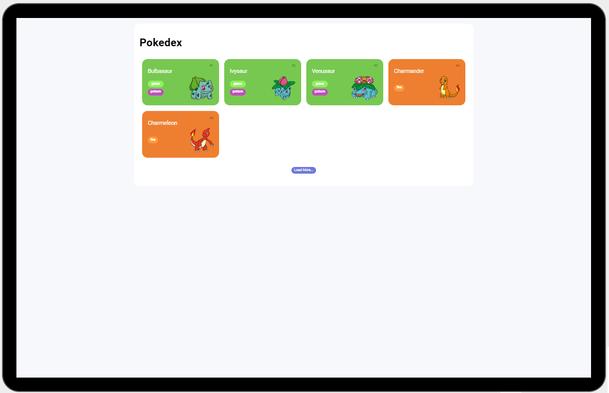
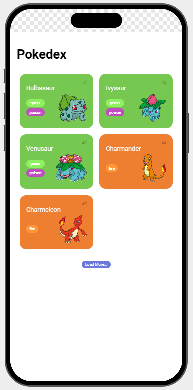

# Pokedex

Uma aplicação web que permite visualizar e explorar informações sobre Pokémon, utilizando a PokeAPI para buscar dados de diferentes Pokémon. O projeto exibe uma lista de Pokémon com suas respectivas informações, incluindo tipo e imagem.

## Sobre

A Pokedex é uma aplicação simples que busca informações sobre os primeiros 151 Pokémon. O usuário pode carregar mais Pokémon clicando no botão "Load More". A aplicação utiliza HTML, CSS e JavaScript, além de realizar chamadas à API pública da PokeAPI.

## Tecnologias Usadas

- **HTML**: Estrutura da página.
- **CSS**: Estilização da interface.
- **JavaScript**: Lógica de interação e chamadas à API.
- **PokeAPI**: API utilizada para obter dados dos Pokémon.

## Imagens

### desktop screen

### mobile screen

